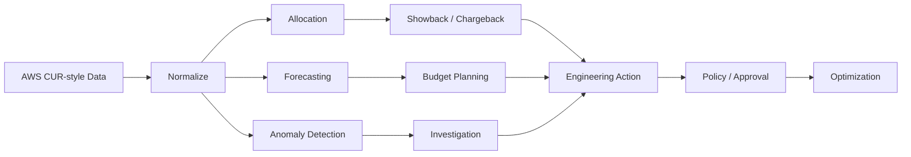

# Cloud FinOps Cost Optimization Platform

<p align="center"><strong>Turn cloud spend into engineering decisions, ownership and measurable governance.</strong></p>

<p align="center">
<a href="https://github.com/obinna-obika-devops/cloud-finops-cost-optimization/actions/workflows/finops-ci.yml"></a>


</p>

Cloud cost problems are rarely just billing problems. They become engineering problems when teams cannot explain ownership, forecast spend, detect abnormal usage, identify waste, or enforce guardrails before costs grow.

This repository implements a production-style FinOps workflow that converts cloud billing data into allocation, forecasting, anomaly detection, rightsizing opportunities, policy checks and actionable reports. It uses synthetic billing data so the engineering can be inspected without exposing real customer or account information.

## What I built

- AWS Cost & Usage Report-style ingestion and normalization using synthetic billing data
- Cost allocation by team, account, environment, service and cost center
- Showback / chargeback reporting and unit-economics patterns
- Spend forecasting for forward budget planning
- Anomaly detection for unusual cost behavior
- Rightsizing and idle-resource opportunity analysis
- Budget and tagging governance checks
- Terraform examples for AWS Budgets and Cost Anomaly Detection
- CI validation that runs tests, FinOps policy gates, report generation and Terraform validation
- Markdown and CSV reporting designed to turn analysis into engineering action

## Architecture



## Engineering decisions

### Make cost ownership explicit
Allocation dimensions are treated as engineering metadata, not finance-only reporting. Teams should be able to identify who owns spend and why it exists.

### Separate detection from action
The platform identifies anomalies, rightsizing candidates and governance violations, but material optimization actions remain behind approval boundaries rather than being executed blindly.

### Use policy before cost becomes waste
Budget and tagging checks are part of the delivery model so missing ownership and governance can be caught early.

### Forecast, not just report history
Historical reporting explains what happened. Forecasting helps teams make capacity, budget and architecture decisions before spend becomes a surprise.

### Keep the analysis reproducible
Synthetic input data, tested Python logic and CI-generated reports make the workflow inspectable and repeatable without depending on private billing systems.

## Evidence at a glance

| FinOps capability | Inspectable evidence |
|---|---|
| Cost ingestion and analytics | [`finops/`](finops/) |
| Synthetic billing dataset | [`data/sample/`](data/sample/) |
| Budget / anomaly infrastructure | [`terraform/`](terraform/) |
| Policy and governance checks | [`scripts/finops_gate.py`](scripts/finops_gate.py) |
| Reports and engineering outputs | [`reports/`](reports/) |
| Automated validation | [`.github/workflows/finops-ci.yml`](.github/workflows/finops-ci.yml) |
| Tests | [`tests/`](tests/) |

## FinOps operating loop

**Allocate → Measure → Forecast → Detect → Investigate → Optimize → Govern → Review**

The objective is not simply to reduce spend. It is to improve cost visibility and decision quality while preserving reliability, performance and delivery speed.

## CI validation

The GitHub Actions workflow validates the engineering path on every push and pull request:

1. Install Python dependencies.
2. Run the automated test suite.
3. Execute the FinOps governance gate.
4. Generate a cost-analysis report from the sample dataset.
5. Upload the generated report as a workflow artifact.
6. Run Terraform formatting, initialization and validation.

This keeps analytics, governance and infrastructure examples continuously testable.

## Engineering components

- `finops/` — normalization, allocation, forecasting, anomaly and optimization logic
- `data/sample/` — synthetic billing data for repeatable analysis
- `scripts/` — FinOps policy and governance checks
- `terraform/` — AWS budget and anomaly-detection infrastructure examples
- `reports/` — generated cost and optimization outputs
- `tests/` — automated tests for FinOps logic
- `.github/workflows/` — CI validation and report generation

## Quick start

```bash
python -m venv .venv && source .venv/bin/activate
pip install -r requirements.txt
python -m pytest -q
python -m finops.cli analyze data/sample/cost_usage.csv --output reports/demo-report.md
python -m finops.cli forecast data/sample/cost_usage.csv --days 30
python -m finops.cli anomalies data/sample/cost_usage.csv
python scripts/finops_gate.py
```

## Production extension

A production implementation can connect the normalized ingestion layer to AWS CUR/Athena, AWS Organizations billing dimensions, OpenCost or Kubernetes telemetry, and an approved reporting destination. Optimization workflows should preserve human approval for material infrastructure changes and validate reliability impact before execution.

## Engineering principles

1. Cost ownership should be visible.
2. Optimization must not compromise reliability.
3. Governance should be automated where possible.
4. Anomalies should be detected before monthly billing review.
5. Forecasting should inform engineering decisions.
6. Material cost changes should remain reviewable and reversible.

## Scope

This repository is a FinOps reference implementation using synthetic demo billing data. It does not claim access to live customer billing information, real production savings, or automatically executed cloud optimization unless those capabilities are explicitly connected and deployed by an operator.
