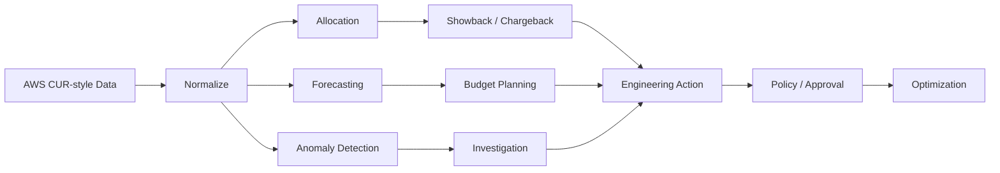

# Cloud FinOps Cost Optimization Platform

<p align="center">
<a href="https://github.com/obinna-obika-devops/cloud-finops-cost-optimization/actions/workflows/finops-ci.yml"></a>


</p>

A production-oriented FinOps reference implementation for turning cloud billing data into engineering decisions: allocation, budgets, forecasting, anomaly detection, rightsizing, and policy automation.

## Architecture



## Evidence at a glance

| FinOps capability | Inspectable evidence |
|---|---|
| Cost ingestion and analytics | [`finops/`](finops/) |
| Synthetic billing dataset | [`data/sample/`](data/sample/) |
| Budget / anomaly infrastructure | [`terraform/`](terraform/) |
| Policy and governance checks | [`scripts/finops_gate.py`](scripts/finops_gate.py) |
| Reports and engineering outputs | [`reports/`](reports/) |
| Automated validation | [`.github/workflows/finops-ci.yml`](.github/workflows/finops-ci.yml) |
| Tests | [`tests/`](tests/) |

## What this demonstrates

- AWS Cost & Usage Report-style ingestion using **synthetic demo data**
- Cost by team, account, environment, service and cost center
- Showback/chargeback and unit economics
- Budget and tagging policy gates
- Trend forecasting and spend anomaly detection
- Rightsizing and idle-resource opportunity detection
- Kubernetes cost allocation concepts
- AWS Budgets and Cost Anomaly Detection Terraform examples
- Scheduled Markdown/CSV reporting
- CI quality gates with Python tests, Terraform validation, Checkov and FinOps policy checks

The repository intentionally contains no real billing credentials or claimed production savings. Sample billing data is synthetic.

## Engineering components

- ingestion and analytics code — cost normalization, forecasting and anomaly logic
- policy checks — budget, tagging and governance controls
- Terraform examples — cloud-native budget/anomaly controls
- tests + `.github/` — CI and validation
- sample reports — translating cost data into engineering action

## Quick start

```bash
python -m venv .venv && source .venv/bin/activate
pip install -r requirements.txt
python -m pytest -q
python -m finops.cli analyze data/sample/cost_usage.csv --output reports/demo-report.md
python -m finops.cli forecast data/sample/cost_usage.csv --days 30
python -m finops.cli anomalies data/sample/cost_usage.csv
python scripts/finops_gate.py
```

## Operating principle

Cloud engineering includes economics as well as availability and performance. The design makes ownership, allocation, efficiency and governance visible while keeping material optimization actions behind appropriate approval boundaries.

## Production extension

Connect the normalized ingestion layer to AWS CUR/Athena, OpenCost/Kubernetes telemetry, AWS Organizations billing dimensions, and an approved reporting destination. Apply human approval to material optimization actions before automation.

## Scope

This is a portfolio/reference implementation using synthetic demo billing data. It does not claim real production savings or access to live customer billing information.
